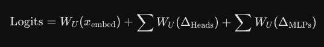

ELI5 for each Method

LIME: Pokes the model with random variations of your input (delete some words/pixels/features), sees how the prediction changes, then draws a simple straight-line approximation through those results. Fast, intuitive, but the explanation can shift depending on how you randomly sample — run it twice, get slightly different weights.

SHAP: Based on a math concept from game theory (Shapley values) — think of each feature as a "player" in a team, and SHAP fairly divides credit for the prediction among all of them by checking every possible combination of features being present/absent. Slower, but more consistent and theoretically guaranteed to add up correctly (all feature contributions sum exactly to the prediction).

Mechanistic Interpretability
Lowest Level:  Individual Neurons (36,000+ isolated numbers) - DLA
     ↓
Structural:    Attention Heads & Full MLP Layers (144 Heads total) - Sum of Neurons for each head and layer
     ↓
Functional:    Circuits (Graph of connected heads performing one task)
     ↓
Conceptual:    Sparse Autoencoder Features (Clean direction vectors)

Direct logit attribution(DLA): Relies on the properts of transfoerms that the residual stream is purely additive. Every attention Head and every MLP layer reads data from here, does it own calculations and adds its results back into the stream.
To convert the final vector to word predictions, it is multipleid by the unembedding matrix. Since multiplication is distributive over addition, we can multiply the unembedding with each individual component. The hook of each element is saved to the cache.
 

Vocabulary Lenses: What a transformer model is "thinking" at its intermediate, hidden layers?

Logit Lens: Works by taking the intermediate mathematical representations from the middle of the network and projecting them directly through the model's final unembedding matrix. This creates a readable distribution of vocabulary probabilities at each layer, revealing what the model would guess as the next word if its computation were stopped early.

Tuned Lens: The Tuned Lens is an advanced iteration of the Logit Lens designed to solve the problem of "basis drift"—the phenomenon where early and middle layers of a neural network operate in different mathematical coordinate systems than the final output layer. Instead of directly applying the final unembedding matrix, the Tuned Lens trains a lightweight, layer-specific affine transformation (a mathematical translator). This translator first rotates and shifts the intermediate layer's representation into alignment with the final layer's expected coordinate space, resulting in highly accurate, less noisy readouts of the model's true internal predictions.

Integrated Gradients: looks inside the model. Uses backpropagation to compute actual gradients — how sensitive the output is to each pixel — at many points along a path from a blank image to the real one, then sums them up.
